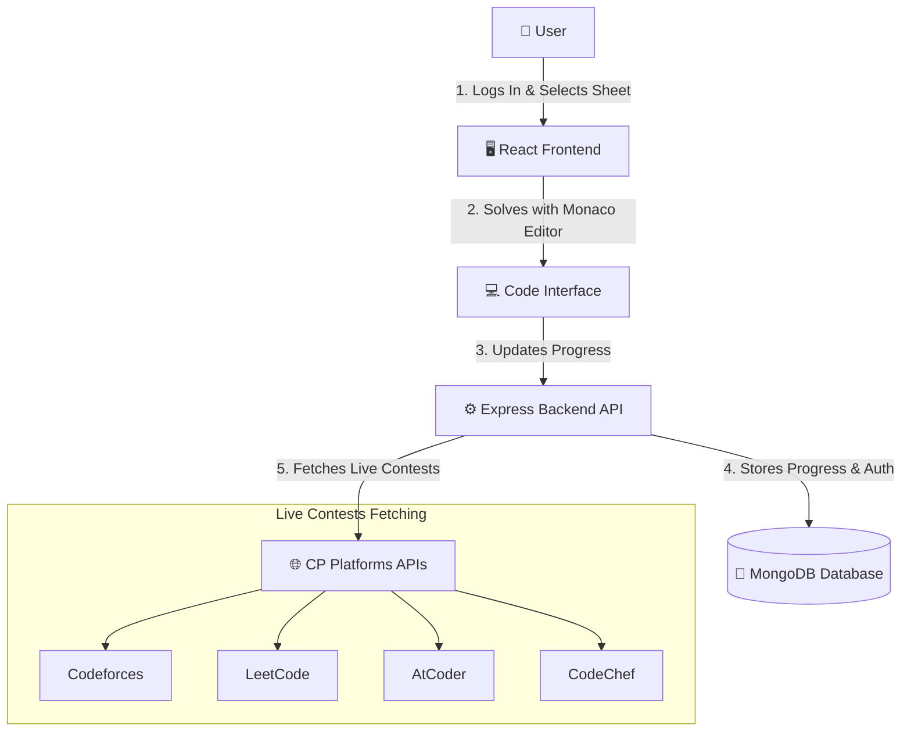

<div align="center">

# 🤖 Code Tracker & DSA Sheet Platform

### Full-Stack Developer Platform for Solving DSA Sheets & Tracking Competitive Contests

[](https://github.com)
[](https://react.dev)
[](https://nodejs.org)
[](https://www.mongodb.com)
[](https://vitejs.dev)


*Solve curated DSA sheets in an interactive code editor, track your learning progress, and stay updated with live contests from top platforms.*

[🚀 Explore Project](#-getting-started) · [📖 Architecture](#-architecture) · [🛠️ Tech Stack](#%EF%B8%8F-tech-stack) · [👥 Contributor](#-contributor)

</div>

---

## 📖 Description

**Code Tracker & DSA Sheet Platform** is a unified learning and preparation workspace built for developers aiming to master Data Structures and Algorithms while keeping their competitive programming game sharp.

By bringing together curated DSA sheets, an in-browser interactive code editor (powered by Monaco Editor), and a live tournament tracker, the platform offers a streamlined, distractions-free practice experience. Users can log in, select specific programming topics, write and test code locally, track their progress with rich analytics, and monitor upcoming contests from Codeforces, LeetCode, AtCoder, and CodeChef all in one place.

---

## 🌟 Key Features

| Feature | Description |
|---------|-------------|
| 💻 **Interactive Code Editor** | Write and test code right inside the application with an integrated Monaco Editor (VS Code style). |
| 📊 **DSA Sheets Tracker** | Progress dashboards that display percentages, progress bars, and track individual problem completions. |
| 🔔 **Live Contest Tracker** | Fetches upcoming coding contests automatically from **Codeforces**, **LeetCode**, **AtCoder**, and **CodeChef**. |
| 🔐 **Hybrid Auth Flow** | Dual login/signup systems supported on both the frontend (React routes) and server-side (EJS rendering views). |
| 📈 **Developer Analytics** | Visual stats cards and interactive progress circles showing exact sheet completion stats. |
| 🗄️ **Automatic Data Seeding** | Pre-bundled DSA repository seed script dynamically populates MongoDB tables with standard DSA problem sets. |

---

## 🎬 How It Works



1. **Dashboard & Contests**: Access upcoming schedules from Codeforces, LeetCode, AtCoder, and CodeChef instantly.
2. **Select a DSA Sheet**: View categorised coding templates (like Striver's SDE sheet or Love Babbar sheets) loaded from MongoDB.
3. **Write Code**: Solve questions inside the web-editor using Monaco editor with full context.
4. **Save & Track**: Complete tasks and track completion metrics updated automatically on your profile.

---

## 🏗️ Architecture

```
PROJECT-WEBDEV/
├── 📁 client/
│   └── 📁 Competitive Programming platform/  # React Frontend (Vite)
│       ├── 📁 public/                         # Static icons & layouts
│       ├── 📁 src/
│       │   ├── 📁 components/                 # Reusable React components (Navbar, Button, Progress)
│       │   ├── 📁 routes/                     # Page routes (Home, Login, Signup, Problem Editor, Profile, Sheets)
│       │   ├── 📁 ui/                         # Layouts, Sidebar, TopNavbar, and Contest trackers
│       │   ├── 📄 App.jsx                     # Route paths & router entry
│       │   └── 📄 main.jsx                    # React app DOM render
│       ├── 📄 vite.config.js                  # Frontend Vite bundler configuration
│       └── 📄 package.json                    # React app dependencies
│
├── 📁 server/                                 # Node.js + Express Backend
│   ├── 📁 models/                             # Mongoose Schemas (User, Sheet, Counter, UserInfo)
│   ├── 📁 views/                              # EJS pages for login, signup, and server-rendered profiles
│   ├── 📄 index.js                            # Express Server & contest fetching API routing
│   ├── 📄 seed.js                             # Automatic db seeder for the DSA sheets
│   └── 📄 package.json                        # Backend libraries & scripts
│
├── 📄 dsa_problems_raw.json                   # Raw problems database seed source
└── 📄 .gitignore                              # Git tracking ignore file
```

---

## 🛠️ Tech Stack

### Frontend
- **React 19** - UI layout library
- **Vite** - Lightning-fast build framework
- **Material-UI (MUI)** - Elegant and clean component layouts
- **Monaco Editor** - Interactive custom code typing console
- **Framer Motion** - Smooth transitions and animations

### Backend
- **Node.js & Express** - High-speed REST API endpoints & proxy servers
- **EJS (Embedded JavaScript)** - Optional server-rendered portal views
- **Mongoose** - Document ODM mapping schemas to MongoDB

### Integrations & Scraping
- **Codeforces API** - Native HTTP fetching
- **LeetCode GraphQL** - Direct query integration
- **Kenkoooo API** - Automated AtCoder contest schedules
- **CodeChef internal routes** - Live contest data pipeline

---

## 🚀 Getting Started

Follow the simple setup steps below to get your workspace running locally.

### 📋 Prerequisites
Make sure you have **Node.js** and **MongoDB** installed on your operating system.

### 1. Database Configuration
Ensure your local MongoDB instance is active:
```bash
# Start MongoDB locally (on macOS via Homebrew)
brew services start mongodb-community
```

### 2. Backend Setup
1. Open your terminal and navigate to the backend folder:
   ```bash
   cd server
   ```
2. Install npm dependencies:
   ```bash
   npm install
   ```
3. Seed the DSA problems database with the provided dataset:
   ```bash
   node seed.js
   ```
4. Fire up the backend server:
   ```bash
   node index.js
   ```
   *The Express server runs by default on `http://localhost:3000`.*

### 3. Frontend Setup
1. Open a new terminal session and head to the client root:
   ```bash
   cd "client/Competitive Programming platform"
   ```
2. Install client dependencies:
   ```bash
   npm install
   ```
3. Run the development server:
   ```bash
   npm run dev
   ```
   *The React interface runs by default on `http://localhost:5173`.*

---

## 👥 Contributor

<div align="center">

Built with ❤️ by **Prakash Kumar**

| Role | Contact | LinkedIn | GitHub |
|------|---------|----------|--------|
| Full-Stack Developer | [+91 9871037499](tel:+919871037499) | [Connect on LinkedIn](https://www.linkedin.com/in/radheprakash/) | [@prakash-knight](https://github.com/prakash-knight) |

</div>

---

## 📜 License

This project is licensed under the ISC License. See the `package.json` file inside `/server` for details.
