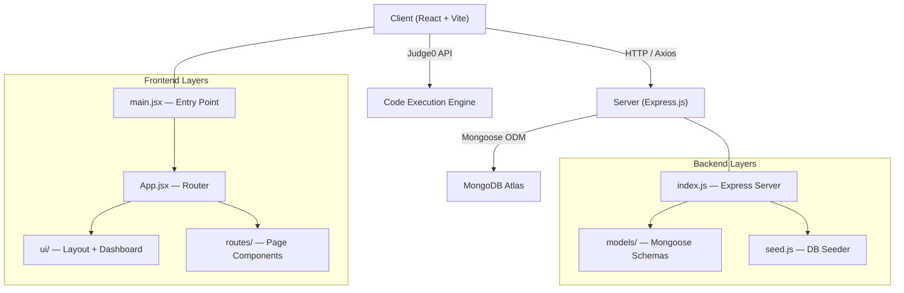

# 🎯 Interview Preparation Roadmap — Competitive Programming Platform

> A complete file-by-file learning guide organized in the **exact sequence** you should study to explain this project confidently in any interview.

---

## 📐 Project Architecture Overview



---

## 🗂️ Complete File Map (19 Active Files)

| # | File | Purpose | Tech Concepts |
|---|------|---------|---------------|
| 1 | `server/package.json` | Server dependencies | npm, Express, Mongoose, CORS |
| 2 | `server/models/loginschema.js` | User auth model | Mongoose Schema, validation |
| 3 | `server/models/userschema.js` | User progress model | Embedded documents, ObjectId refs |
| 4 | `server/models/sheetschemas.js` | Sheet + Problem + Counter models | Pre-save hooks, auto-increment IDs |
| 5 | `server/seed.js` | Database seeder script | Bulk insert, JSON file parsing |
| 6 | `server/index.js` | Express REST API server | REST endpoints, CORS, Promise.allSettled |
| 7 | `client/package.json` | Client dependencies | React, Vite, MUI, Monaco Editor |
| 8 | `client/src/config.js` | API base URL config | Environment variables, Vite env |
| 9 | `client/src/main.jsx` | React entry point | createRoot, StrictMode |
| 10 | `client/src/App.jsx` | App router | React Router v7, route mapping |
| 11 | `client/src/ui/Layout.jsx` | Layout wrapper | Component composition, children prop |
| 12 | `client/src/ui/TopNavbar.jsx` | Top navigation bar | useRef, useEffect cleanup, conditional rendering |
| 13 | `client/src/ui/Sidebar.jsx` | Sidebar navigation | useLocation, active route detection |
| 14 | `client/src/ui/StatCards.jsx` | Dashboard stat cards | Props, dynamic data rendering |
| 15 | `client/src/ui/ContestSection.jsx` | Contest listing | Filtering, countdown timer, setInterval |
| 16 | `client/src/ui/HomePage.jsx` | Dashboard page | useEffect data fetching, localStorage |
| 17 | `client/src/ui/styles.css` | Global UI styles | CSS variables, responsive design |
| 18 | `client/src/routes/signup.jsx` | Signup page | Controlled forms, Axios POST, error handling |
| 19 | `client/src/routes/login.jsx` | Login page | Auth flow, localStorage token |
| 20 | `client/src/routes/logout.jsx` | Logout handler | useEffect side effect, session cleanup |
| 21 | `client/src/routes/profile.jsx` | User profile page | Dynamic params, SVG rendering, heatmap |
| 22 | `client/src/routes/sheets.jsx` | DSA sheets page | MUI Accordion, Tabs, grouped data |
| 23 | `client/src/routes/problem.jsx` | Code editor page | Monaco Editor, Judge0 API, multi-language |
| 24 | `client/src/routes/problem.styles.js` | Editor page styles | MUI `sx` pattern, style object extraction |
| 25 | `client/src/App.css` | Auth & global styles | CSS styling, form cards |

---

## 📚 Learning Sequence — 5 Phases

---

### 🔴 Phase 1: Backend Foundation (Start Here)

> **Why first?** Everything on the frontend depends on backend APIs. Understanding the data models and endpoints first makes the frontend trivial to explain.

---

#### Step 1.1 — [package.json](file:///Users/radhekrishna/Desktop/Radha_rani_Coder/PROJECT-WEBDEV/server/package.json)
**What to learn:**
- What each dependency does: `express`, `mongoose`, `cors`, `dotenv`
- Difference between `dependencies` vs `devDependencies`
- `"main": "app.js"` vs `"scripts.start": "node index.js"`

**🎤 Interview Questions:**
- *"Why did you use Express instead of Fastify/Koa?"*
- *"What does CORS middleware do and why is it needed?"*
- *"How does `dotenv` work?"*

---

#### Step 1.2 — [loginschema.js](file:///Users/radhekrishna/Desktop/Radha_rani_Coder/PROJECT-WEBDEV/server/models/loginschema.js)
**What to learn:**
- Mongoose Schema definition with validation (`required`, `unique`, `lowercase`, `trim`)
- `mongoose.model()` — creating a Model from a Schema
- Why passwords are stored in plaintext here (and how you'd improve it with `bcrypt`)

**🎤 Interview Questions:**
- *"How does Mongoose differ from the native MongoDB driver?"*
- *"What does `unique: true` do at the database level?"*
- *"How would you hash passwords before saving?"* → `bcryptjs` + `pre('save')` hook

---

#### Step 1.3 — [userschema.js](file:///Users/radhekrishna/Desktop/Radha_rani_Coder/PROJECT-WEBDEV/server/models/userschema.js)
**What to learn:**
- Embedded subdocuments (array of objects with `sheetId`, `questionsDone`, `totalQuestions`)
- ObjectId references (`ref: "Sheet"`)
- Schema design decisions: embedding vs referencing

**🎤 Interview Questions:**
- *"Why did you embed progress inside the user document instead of a separate collection?"*
- *"What is `mongoose.Schema.Types.ObjectId` and when do you use `ref`?"*
- *"How would you populate referenced fields?"*

---

#### Step 1.4 — [sheetschemas.js](file:///Users/radhekrishna/Desktop/Radha_rani_Coder/PROJECT-WEBDEV/server/models/sheetschemas.js) ⭐ Most Complex Model
**What to learn:**
- Multiple models in one file (`Counter`, `Sheet`, `Problem`)
- **Auto-increment pattern**: Counter collection + `findByIdAndUpdate` with `$inc`
- **Pre-save hook** (`problemSchema.pre("save")`) — runs before every `.save()`
- Human-readable IDs: `P0001`, `P0042` using `String.padStart(4, "0")`
- Indexes: `unique`, `index: true`

**🎤 Interview Questions:**
- *"How does auto-incrementing IDs work in MongoDB without `AUTO_INCREMENT`?"*
- *"What is a Mongoose middleware/hook? Explain pre-save vs post-save."*
- *"Why create a separate Counter collection?"*
- *"What does `returnDocument: 'after'` mean in `findByIdAndUpdate`?"*

---

#### Step 1.5 — [seed.js](file:///Users/radhekrishna/Desktop/Radha_rani_Coder/PROJECT-WEBDEV/server/seed.js)
**What to learn:**
- Database seeding pattern
- `fs.readFileSync` to load JSON data
- `Model.create()` (bulk insert — triggers pre-save hooks)
- `deleteMany({})` — clearing collections before re-seeding
- Graceful disconnect with `mongoose.disconnect()`

**🎤 Interview Questions:**
- *"How do you populate your database with initial data?"*
- *"What's the difference between `insertMany()` and `create()` in Mongoose?"*
- *"Why do you clear data before seeding?"*

---

#### Step 1.6 — [index.js](file:///Users/radhekrishna/Desktop/Radha_rani_Coder/PROJECT-WEBDEV/server/index.js) ⭐ The Server Core
**What to learn:**

| Endpoint | Method | What it does |
|----------|--------|--------------|
| `/` | GET | Health check |
| `/auth/signup` | POST | Create user account |
| `/auth/login` | POST | Authenticate user |
| `/sheets` | GET | List all DSA sheets |
| `/sheets/:sheetId/problems` | GET | Get problems for a sheet |
| `/user/:userid` | GET | Get user profile + progress |
| `/api/contests` | GET | Aggregate contests from 4 platforms |
| `/editor/:problemId` | GET | Get single problem data |

**Key Concepts:**
- RESTful API design patterns
- `Promise.allSettled()` for parallel API calls that can fail independently
- Spreading password from response: `const { password, ...safeUser } = user.toObject()`
- Error handling: `try/catch` + status codes (409, 401, 404, 500)
- Fetching external APIs server-side (Codeforces, LeetCode GraphQL, AtCoder, CodeChef)

**🎤 Interview Questions:**
- *"Walk me through the signup flow end to end."*
- *"Why use `Promise.allSettled` instead of `Promise.all` for contests?"*
- *"How do you prevent password leaks in API responses?"*
- *"What is the LeetCode GraphQL query doing?"*
- *"How would you add JWT authentication?"*
- *"What HTTP status codes do you use and why?"*

---

### 🟡 Phase 2: Client Foundation & Configuration

---

#### Step 2.1 — [package.json](file:///Users/radhekrishna/Desktop/Radha_rani_Coder/PROJECT-WEBDEV/client/Competitive%20Programming%20platform/package.json)
**What to learn:**
- Key frontend deps: `react`, `react-router-dom`, `axios`, `@mui/material`, `@monaco-editor/react`
- Vite vs Create React App
- `@emotion/react` and `@emotion/styled` — MUI's styling engine

**🎤 Interview Questions:**
- *"Why Vite over CRA?"* (faster HMR, ESBuild bundling)
- *"What is Emotion and why does MUI use it?"*

---

#### Step 2.2 — [config.js](file:///Users/radhekrishna/Desktop/Radha_rani_Coder/PROJECT-WEBDEV/client/Competitive%20Programming%20platform/src/config.js)
**What to learn:**
- `import.meta.env.VITE_API_URL` — Vite environment variables (must be prefixed with `VITE_`)
- Fallback URL pattern with `||`
- Centralizing API base URL for easy deployment switching

**🎤 Interview Questions:**
- *"How do environment variables work in Vite?"*
- *"How do you switch between dev and production API URLs?"*

---

#### Step 2.3 — [main.jsx](file:///Users/radhekrishna/Desktop/Radha_rani_Coder/PROJECT-WEBDEV/client/Competitive%20Programming%20platform/src/main.jsx)
**What to learn:**
- React 19's `createRoot()` API
- `StrictMode` — what it does (double-renders in dev to catch issues)
- Mounting React to the DOM (`#root`)

---

#### Step 2.4 — [App.jsx](file:///Users/radhekrishna/Desktop/Radha_rani_Coder/PROJECT-WEBDEV/client/Competitive%20Programming%20platform/src/App.jsx) ⭐ Routing Core
**What to learn:**

| Route | Component | Purpose |
|-------|-----------|---------|
| `/` | `<Home />` | Dashboard |
| `/signup` | `<Signup />` | Registration |
| `/login` | `<Login />` | Authentication |
| `/sheets` | `<Sheets />` | DSA problem sheets |
| `/user/:userid` | `<Profile />` | User profile (dynamic param) |
| `/profile` | `<ProfileRedirect />` | Redirects to `/user/{id}` |
| `/logout` | `<Logout />` | Session cleanup |
| `/editor/:problemId` | `<Problem />` | Code editor |

**Key Concepts:**
- `<BrowserRouter>`, `<Routes>`, `<Route>`
- Dynamic route params (`:userid`, `:problemId`)
- `<Navigate>` for programmatic redirects
- Protected route pattern via `ProfileRedirect` component
- Reading from `localStorage` for auth state

**🎤 Interview Questions:**
- *"How does React Router v7 differ from v5?"*
- *"Explain the `ProfileRedirect` component — how does it protect the profile route?"*
- *"What are dynamic route parameters?"*

---

### 🟢 Phase 3: Layout & UI Components

---

#### Step 3.1 — [Layout.jsx](file:///Users/radhekrishna/Desktop/Radha_rani_Coder/PROJECT-WEBDEV/client/Competitive%20Programming%20platform/src/ui/Layout.jsx)
**What to learn:**
- Layout pattern: wraps all pages with consistent TopNavbar + Sidebar
- `children` prop — React composition
- Sidebar toggle state with `useState`

**🎤 Interview Questions:**
- *"What is the children prop pattern and why is it useful?"*
- *"How does your layout system ensure consistency across pages?"*

---

#### Step 3.2 — [TopNavbar.jsx](file:///Users/radhekrishna/Desktop/Radha_rani_Coder/PROJECT-WEBDEV/client/Competitive%20Programming%20platform/src/ui/TopNavbar.jsx)
**What to learn:**
- `useRef` for dropdown click-outside detection
- `useEffect` cleanup: adding/removing event listeners
- Conditional rendering based on `localStorage.getItem("userid")`
- Avatar dropdown with login/logout states

**🎤 Interview Questions:**
- *"How do you detect clicks outside a dropdown to close it?"*
- *"Why do you need to return a cleanup function from useEffect?"*
- *"How does the navbar change for logged-in vs logged-out users?"*

---

#### Step 3.3 — [Sidebar.jsx](file:///Users/radhekrishna/Desktop/Radha_rani_Coder/PROJECT-WEBDEV/client/Competitive%20Programming%20platform/src/ui/Sidebar.jsx)
**What to learn:**
- `useLocation()` — getting current path for active link highlighting
- Mobile overlay pattern (dark backdrop + slide-in sidebar)
- Navigation items as config arrays

**🎤 Interview Questions:**
- *"How do you highlight the currently active navigation item?"*

---

#### Step 3.4 — [StatCards.jsx](file:///Users/radhekrishna/Desktop/Radha_rani_Coder/PROJECT-WEBDEV/client/Competitive%20Programming%20platform/src/ui/StatCards.jsx)
**What to learn:**
- Pure presentational component (receives data via props)
- Dynamic icon/color mapping using configuration arrays

---

#### Step 3.5 — [ContestSection.jsx](file:///Users/radhekrishna/Desktop/Radha_rani_Coder/PROJECT-WEBDEV/client/Competitive%20Programming%20platform/src/ui/ContestSection.jsx) ⭐ Rich Component
**What to learn:**
- **Filter chips** pattern (button group that filters a list)
- **Countdown timer** with `setInterval` + `useEffect` cleanup
- Platform detection via string matching
- Dynamic platform icons (react-icons: `SiLeetcode`, `SiCodeforces`, `SiCodechef`)
- Date formatting with `toLocaleString("en-IN")`

**🎤 Interview Questions:**
- *"How does the countdown timer work? What happens when the component unmounts?"*
- *"How do you implement client-side filtering?"*

---

### 🔵 Phase 4: Route Pages (Core Features)

---

#### Step 4.1 — [signup.jsx](file:///Users/radhekrishna/Desktop/Radha_rani_Coder/PROJECT-WEBDEV/client/Competitive%20Programming%20platform/src/routes/signup.jsx)
**What to learn:**
- Controlled form components (`value` + `onChange`)
- Generic `handleChange` with `event.target.name` / `event.target.value`
- POST request with Axios
- Storing auth data in `localStorage` after successful signup
- Error message display with conditional styling

**🎤 Interview Questions:**
- *"What is a controlled component in React?"*
- *"How does your generic `handleChange` work for multiple inputs?"*
- *"How do you handle and display API errors?"*

---

#### Step 4.2 — [login.jsx](file:///Users/radhekrishna/Desktop/Radha_rani_Coder/PROJECT-WEBDEV/client/Competitive%20Programming%20platform/src/routes/login.jsx)
**What to learn:**
- Same form pattern as signup (compare and contrast)
- `useNavigate()` for programmatic navigation after login
- Error classification by message content

---

#### Step 4.3 — [logout.jsx](file:///Users/radhekrishna/Desktop/Radha_rani_Coder/PROJECT-WEBDEV/client/Competitive%20Programming%20platform/src/routes/logout.jsx)
**What to learn:**
- Side-effect-only component (no real UI)
- `useEffect` for one-time actions on mount
- `localStorage.removeItem()` + `sessionStorage.clear()`
- `navigate("/", { replace: true })` — `replace` prevents back-button returning to logout

**🎤 Interview Questions:**
- *"Why use `replace: true` in navigation?"*

---

#### Step 4.4 — [HomePage.jsx](file:///Users/radhekrishna/Desktop/Radha_rani_Coder/PROJECT-WEBDEV/client/Competitive%20Programming%20platform/src/ui/HomePage.jsx)
**What to learn:**
- Dashboard data aggregation (contests + user progress)
- Loading states
- Composing `StatCards` + `ContestSection` into a page
- Conditional API call (only fetch user progress if logged in)

---

#### Step 4.5 — [sheets.jsx](file:///Users/radhekrishna/Desktop/Radha_rani_Coder/PROJECT-WEBDEV/client/Competitive%20Programming%20platform/src/routes/sheets.jsx) ⭐ Data-Heavy Page
**What to learn:**
- **Two-step data loading**: sheets first → problems on tab change
- MUI components: `Tabs`, `Accordion`, `Chip`, `CircularProgress`
- Grouping data by topic: `problems.forEach → groups[p.topic]`
- Nested Accordions (Topic → Individual Problems)
- Two navigation paths: "Solve on Platform" (external link) vs "Solve in Editor" (internal `navigate`)

**🎤 Interview Questions:**
- *"How do you group problems by topic?"*
- *"Why fetch problems only when the active sheet changes?"*
- *"Explain the nested accordion UI pattern."*

---

#### Step 4.6 — [profile.jsx](file:///Users/radhekrishna/Desktop/Radha_rani_Coder/PROJECT-WEBDEV/client/Competitive%20Programming%20platform/src/routes/profile.jsx) ⭐ Most Visual Component
**What to learn:**
- `useParams()` to get `:userid` from URL
- **SVG Circular Progress** — manual SVG rendering with `stroke-dasharray` / `stroke-dashoffset`
- **GitHub-style Activity Heatmap** — deterministic random data generation using hash function
- Streak calculation algorithm (current streak + max streak)
- Badge/rank system based on solved count thresholds
- CSS Grid for heatmap cells, month labels, day labels
- Error and loading states

**🎤 Interview Questions:**
- *"How does the circular progress SVG work mathematically?"*
- *"How do you generate the activity heatmap data?"*
- *"What is a deterministic random generator and why use one here?"*
- *"Explain the streak calculation logic."*
- *"How does the badge system work?"*

---

#### Step 4.7 — [problem.jsx](file:///Users/radhekrishna/Desktop/Radha_rani_Coder/PROJECT-WEBDEV/client/Competitive%20Programming%20platform/src/routes/problem.jsx) + [problem.styles.js](file:///Users/radhekrishna/Desktop/Radha_rani_Coder/PROJECT-WEBDEV/client/Competitive%20Programming%20platform/src/routes/problem.styles.js) ⭐ Star Feature
**What to learn:**
- **Monaco Editor** integration (same editor as VS Code)
- `useRef` for editor instance access (`editorRef.current.getValue()`)
- **Judge0 API** for code execution (8 languages supported)
- Language templates, language IDs mapping
- DOM manipulation in React (`useEffect` to override root styles for full-width editor)
- Console output panel: stdout, stderr, compile_output, execution stats

**🎤 Interview Questions:**
- *"How does the Monaco Editor integration work?"*
- *"Walk me through the code execution flow using Judge0."*
- *"Why do you manipulate DOM styles directly in `useEffect` instead of CSS?"*
- *"How do you handle compilation errors vs runtime errors?"*
- *"What is `editorRef` and why use `useRef` here?"*

---

### 🟣 Phase 5: Styling & Polish

---

#### Step 5.1 — [styles.css](file:///Users/radhekrishna/Desktop/Radha_rani_Coder/PROJECT-WEBDEV/client/Competitive%20Programming%20platform/src/ui/styles.css)
**What to learn:**
- CSS custom properties (variables) for theming
- Dark theme design system
- Responsive design with media queries
- Glassmorphism effects
- Heatmap grid layout with CSS Grid
- Animation keyframes

---

#### Step 5.2 — [App.css](file:///Users/radhekrishna/Desktop/Radha_rani_Coder/PROJECT-WEBDEV/client/Competitive%20Programming%20platform/src/App.css)
**What to learn:**
- Global reset styles
- Auth page styling (login/signup cards)
- Base typography

---

## 🏆 Top 20 Interview Questions & Where to Find Answers

| # | Question | Answer File(s) |
|---|----------|----------------|
| 1 | Explain the overall architecture | `App.jsx` + `server/index.js` |
| 2 | How does authentication work? | `login.jsx` → `server/index.js` (POST `/auth/login`) |
| 3 | How do you store user sessions? | `login.jsx` (localStorage) |
| 4 | How are DSA problems organized? | `sheetschemas.js` → `sheets.jsx` |
| 5 | How does the code editor work? | `problem.jsx` (Monaco + Judge0) |
| 6 | How do you fetch contests from multiple platforms? | `server/index.js` (`/api/contests`) |
| 7 | What is `Promise.allSettled`? | `server/index.js` (contest aggregation) |
| 8 | How does the auto-increment ID work? | `sheetschemas.js` (Counter + pre-save) |
| 9 | How do you track user progress? | `userschema.js` + `profile.jsx` |
| 10 | How is the heatmap generated? | `profile.jsx` (`getContributionData`) |
| 11 | How does React Router work in your app? | `App.jsx` |
| 12 | What is the Layout pattern? | `Layout.jsx` + `TopNavbar.jsx` + `Sidebar.jsx` |
| 13 | How do you handle API errors? | `login.jsx` / `signup.jsx` (catch blocks) |
| 14 | How does the circular progress SVG work? | `profile.jsx` (`CircularProgress` component) |
| 15 | Why did you choose MongoDB? | Schema flexibility for varying problem structures |
| 16 | How would you improve security? | bcrypt, JWT, rate limiting, input validation |
| 17 | How do you handle responsive design? | `styles.css` (media queries, CSS Grid) |
| 18 | What is MUI and why did you use it? | `sheets.jsx`, `problem.jsx` (Accordion, Tabs) |
| 19 | How do you deploy this? | Render (backend), Vite build (frontend) |
| 20 | What would you add next? | Leaderboard, real test cases, WebSocket contests |

---

## ⚡ Quick Revision Checklist

```
✅ Backend: Express → Routes → Mongoose Models → MongoDB
✅ Auth: Signup/Login → localStorage → ProfileRedirect
✅ Data Flow: Sheets → Problems → Problem Editor
✅ Code Execution: Monaco Editor → Judge0 API → Console Output
✅ Contest Aggregation: Promise.allSettled across 4 platforms
✅ Profile: SVG Progress + Heatmap + Streak Algorithm
✅ Styling: CSS Variables → Dark Theme → Responsive
```

> [!TIP]
> **For each file, practice saying:** *"This file does X. It uses Y technology. The key decision I made here was Z."*
> That's the formula for a confident interview answer.
